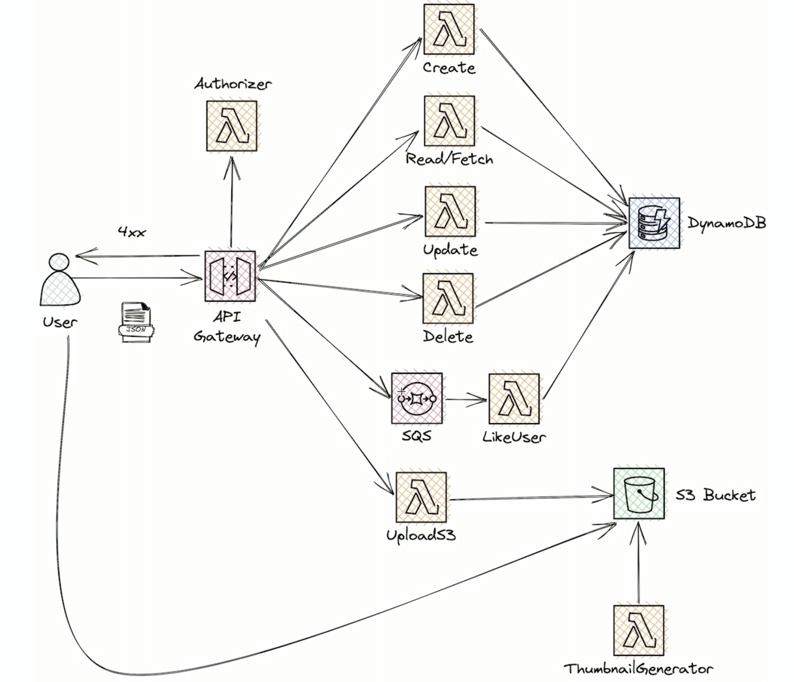

<!--
https://github.com/Eduardo2505/serverless_framework_produccion
-->

# Arquitectura
<br>



<br>

# Install

```bash
#npm install -g serverless
#npm install serverless-offline --save-dev
#npm install --save serverless-dynamodb-local
sls dynamodb install
#npm install --production sharp --arch=x64 --platform=linux
sls logs --function sqs-queueWorker
```
## Usage

### Deployment

```
$ serverless deploy
```

After deploying, you should see output similar to:

```bash
Deploying aws-node-http-api-project to stage dev (us-east-1)

✔ Service deployed to stack aws-node-http-api-project-dev (152s)

endpoint: GET - https://xxxxxxxxxx.execute-api.us-east-1.amazonaws.com/
functions:
  hello: aws-node-http-api-project-dev-hello (1.9 kB)
```

_Note_: In current form, after deployment, your API is public and can be invoked by anyone. For production deployments, you might want to configure an authorizer. For details on how to do that, refer to [http event docs](https://www.serverless.com/framework/docs/providers/aws/events/apigateway/).

### Invocation

After successful deployment, you can call the created application via HTTP:

```bash
curl https://xxxxxxx.execute-api.us-east-1.amazonaws.com/
```

Which should result in response similar to the following (removed `input` content for brevity):

```json
{
  "message": "Go Serverless v2.0! Your function executed successfully!",
  "input": {
    ...
  }
}
```

### Local development

You can invoke your function locally by using the following command:

```bash
serverless invoke local --function hello
```

Which should result in response similar to the following:

```
{
  "statusCode": 200,
  "body": "{\n  \"message\": \"Go Serverless v3.0! Your function executed successfully!\",\n  \"input\": \"\"\n}"
}
```


Alternatively, it is also possible to emulate API Gateway and Lambda locally by using `serverless-offline` plugin. In order to do that, execute the following command:

```bash
serverless plugin install -n serverless-offline
```

It will add the `serverless-offline` plugin to `devDependencies` in `package.json` file as well as will add it to `plugins` in `serverless.yml`.

After installation, you can start local emulation with:

```
sls offline start
```

### Layers

```
npm install --production --arch=x64 --platform=linux
mkdir nodejs
mv node_modules nodejs
#apt update -y && apt install zip -y
zip -r nodejs.zip nodejs/
```
```
aws lambda publish-layer-version --layer-name sls-crud-layer --description "SLS Library" --license-info "MIT" --zip-file fileb://nodejs.zip
```

### Serverless Apigateway Service Proxy
```
serverless plugin install -n serverless-apigateway-service-proxy
```

### Serverless Lift
```
serverless plugin install -n serverless-lift
```
## serverless-domain-manager

```
npm install serverless-domain-manager --save-dev

```